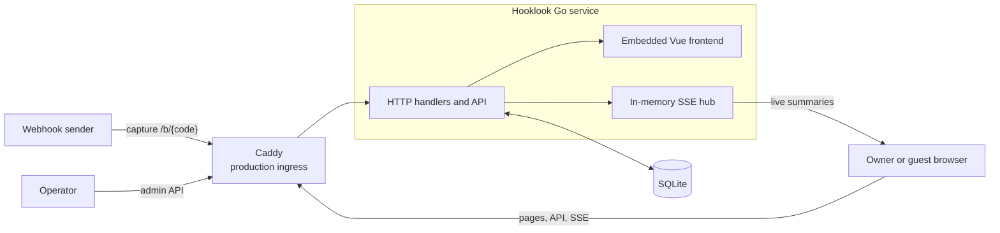
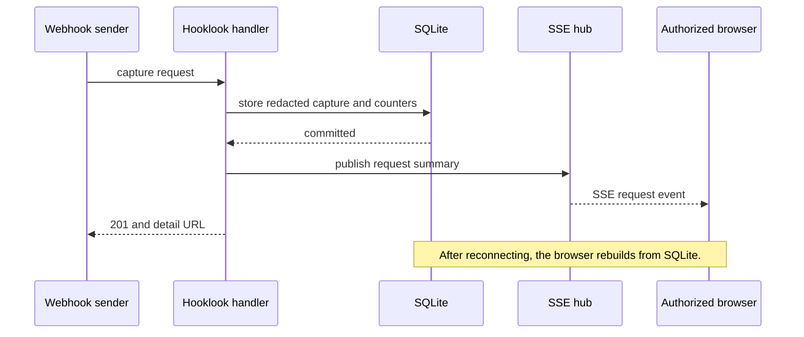
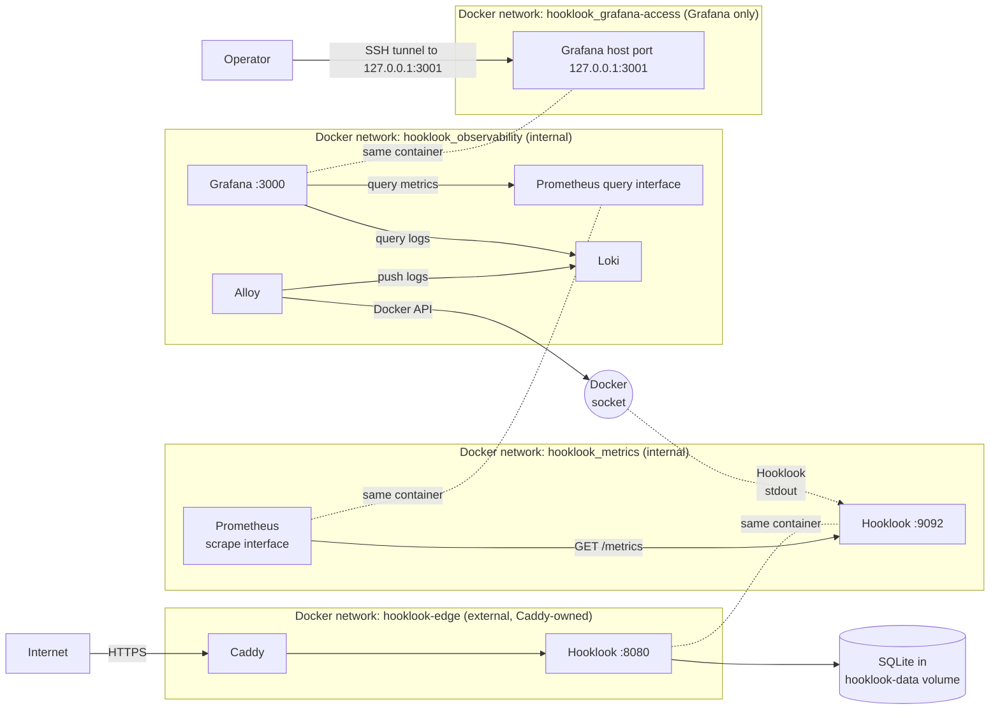

# Current architecture

This document describes Hooklook's components, their boundaries, and the flow
of a captured request. It intentionally does not repeat SQLite configuration,
schema, or failure handling; [database behavior](db.md) is the source for
those details.

## System shape

Hooklook is one Go `net/http` service. It serves the browser UI and HTTP API,
accepts public webhook captures, and streams persisted changes to authorized
inspectors through Server-Sent Events (SSE). There are no accounts, separate
application services, queues, caches, or distributed storage in v1.

SQLite is the only durable state. It contains bins, captured requests, access
state, expiry state, and capacity counters. The SSE hub is deliberately
ephemeral: a reconnecting browser reads the persisted request list again rather
than relying on events it missed.

The frontend build is embedded with `go:embed`, so the compiled binary is the
application unit. Page authorization happens in Go before the Vue application
loads. The browser then uses the same origin for its API and SSE requests.

## Capture and live updates

Capture handling makes persistence the boundary between a successful capture
and a live notification. The service redacts credential-like headers before it
writes the capture. It publishes a request summary only after SQLite commits,
so an SSE event never refers to data a reconnecting browser cannot retrieve.

Delete and clear actions likewise commit their change before publishing a
refresh event. Slow SSE subscribers are disconnected rather than allowed to
delay request handling. The [HTTP API](http-api.md) specifies the wire
contract, while [frontend behavior](frontend/frontend.md) describes browser-side
reconnection and rendering.

## Deployment and ingress boundary

Caddy is not part of this repository. It runs as a separate Compose project,
[hetzner-one](https://github.com/dvinubius/hetzner-one), which owns the VPS's
public ports, TLS, the `hooklook.app` route and edge limits (see its
[`Caddyfile`](https://github.com/dvinubius/hetzner-one/blob/main/Caddyfile)),
and creates the `hooklook-edge` network. The same Caddy also serves other
sites on the VPS.

Local development defaults `LISTEN_ADDRESS` to `127.0.0.1:8080`. Docker sets it
to `0.0.0.0:8080` so Caddy can reach the app through `hooklook-edge`, the
external network owned by Caddy. The app is also published to the host only at
`127.0.0.1:8081` for local checks. Caddy terminates TLS, applies a 10 MB
(10,000,000-byte) body limit to capture routes, and enforces public rate and
header limits. Hooklook owns
authorization, capture consistency, retention, and capacity decisions.

### Port inventory

| Port | Protocol | Where it is reachable | Core purpose |
| --- | --- | --- | --- |
| 80 | TCP | Public VM listener owned by shared Caddy | HTTP entry point and HTTPS redirection/certificate handling |
| 443 | TCP | Public VM listener owned by shared Caddy | HTTPS for `hooklook.app` |
| 443 | UDP | Public VM listener owned by shared Caddy | HTTP/3 for the same HTTPS site |
| 8080 | TCP | Hooklook container on `hooklook-edge` and `hooklook_metrics` | Application HTTP listener: pages, capture API, SSE, admin routes, `/health`, and `/ready` |
| 8081 | TCP | VM loopback `127.0.0.1` only, mapped to container port 8080 | Local application health and readiness checks |

The shared Caddy service owns public 80/443; Hooklook publishes only the
loopback mapping for its HTTP listener. Port 8080 accepts connections on both
of Hooklook's Docker networks because the listener binds to `0.0.0.0` inside
the container. The separate metrics listener and telemetry-service ports are
inventoried in [observability](observability.md#port-inventory).

The paired Hooklook, Prometheus, and Grafana boxes each represent one container
attached to two networks. Compose fixes the project name to `hooklook`, so its
created networks are `hooklook_metrics`,
`hooklook_observability`, and `hooklook_grafana-access`. The
external ingress network keeps its literal name, `hooklook-edge`. Grafana's
access bridge is non-internal and has no other Hooklook member: Docker cannot
publish its loopback port from an internal-only bridge on the production host.
The private metrics listener has no host port or Caddy route. Only Grafana
publishes a telemetry port, on host loopback.

Both Hooklook listeners bind to `0.0.0.0` inside the same container. Caddy can
therefore reach port 9092 on `hooklook-edge`, and Prometheus can reach port
8080 on `hooklook_metrics`; Docker's `expose` declaration does not restrict
either path. The metrics endpoint remains outside the public Caddy routes and
has no host publication. See [deployment security](security.md) for the trust
boundary implications.

Alloy reads Hooklook's container stdout through the Docker socket, filtered by
Compose project and service labels. See the
[observability overview](observability.md) for the private telemetry topology
and [observability runbook](observability-runbook.md) for local validation.

## Where to find detail

- [Deployment security](security.md): trust boundaries, sensitive data,
  privileged access, and operational checks.
- [Observability](observability.md): telemetry topology, ports, signals, and
  dashboard behavior.
- [Database behavior](db.md): SQLite setup, schema, transactions, and database
  failure handling.
- [Bin access](bin-access.md): ownership cookies, invitations, and mutation
  authorization.
- [Bin lifecycle](bin-lifecycle.md): renewal, cleanup, and expiry.
- [Storage capacity and backups](storage-capacity.md): limits, `507` behavior,
  backup, and restore.
- [HTTP API](http-api.md): routes, response formats, and SSE protocol.
- [Frontend behavior](frontend/frontend.md): browser-side session, reconnection, and
  rendering behavior.
