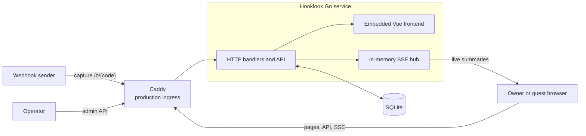
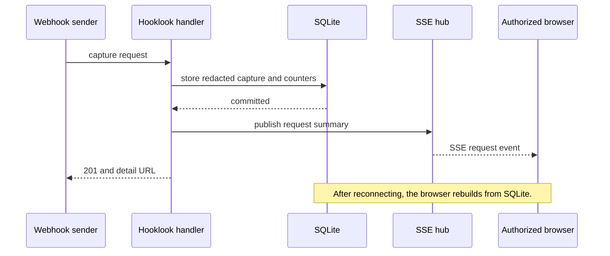

# Current architecture

This document describes Hooklook's components, their boundaries, and the flow
of a captured request. It intentionally does not repeat SQLite configuration,
schema, or failure handling; [database behavior](db.md) is the source for
those details.

## System shape

Hooklook is one Go `net/http` service. It serves the browser UI and HTTP API,
accepts public webhook captures, and streams persisted changes to authorized
inspectors through Server-Sent Events (SSE). There are no accounts, separate
application services, queues, caches, or distributed storage in v1.

SQLite is the only durable state. It contains bins, captured requests, access
state, expiry state, and capacity counters. The SSE hub is deliberately
ephemeral: a reconnecting browser reads the persisted request list again rather
than relying on events it missed.

The frontend build is embedded with `go:embed`, so the compiled binary is the
application unit. Page authorization happens in Go before the Vue application
loads. The browser then uses the same origin for its API and SSE requests.

## Capture and live updates

Capture handling makes persistence the boundary between a successful capture
and a live notification. The service redacts credential-like headers before it
writes the capture. It publishes a request summary only after SQLite commits,
so an SSE event never refers to data a reconnecting browser cannot retrieve.

Delete and clear actions likewise commit their change before publishing a
refresh event. Slow SSE subscribers are disconnected rather than allowed to
delay request handling. The [HTTP API](http-api.md) specifies the wire
contract, while [frontend behavior](frontend.md) describes browser-side
reconnection and rendering.

## Deployment and ingress boundary

Local development defaults `LISTEN_ADDRESS` to `127.0.0.1:8080`. The intended
Docker deployment supplies `LISTEN_ADDRESS=0.0.0.0:8080` so Caddy can reach the
application through a private Docker network; loopback-only host publication
and Docker network membership prevent direct public access to the application
container.

In the intended deployment, Caddy is the public TLS and ingress-policy
boundary. It owns rate limits and the total request-header limit before traffic
reaches Hooklook. Its request-body limit applies to public capture routes.
The Go service owns application authorization, capture consistency, retention,
and capacity decisions. See the
[shipping plan](../.agents/SHIP_PLAN.md) for the in-progress deployment
implementation.

## Where to find detail

- [Database behavior](db.md): SQLite setup, schema, transactions, and database
  failure handling.
- [Bin access](bin-access.md): ownership cookies, invitations, and mutation
  authorization.
- [Bin lifecycle](bin-lifecycle.md): renewal, cleanup, and expiry.
- [Storage capacity and backups](storage-capacity.md): limits, `507` behavior,
  backup, and restore.
- [HTTP API](http-api.md): routes, response formats, and SSE protocol.
- [Frontend behavior](frontend.md): browser-side session, reconnection, and
  rendering behavior.
