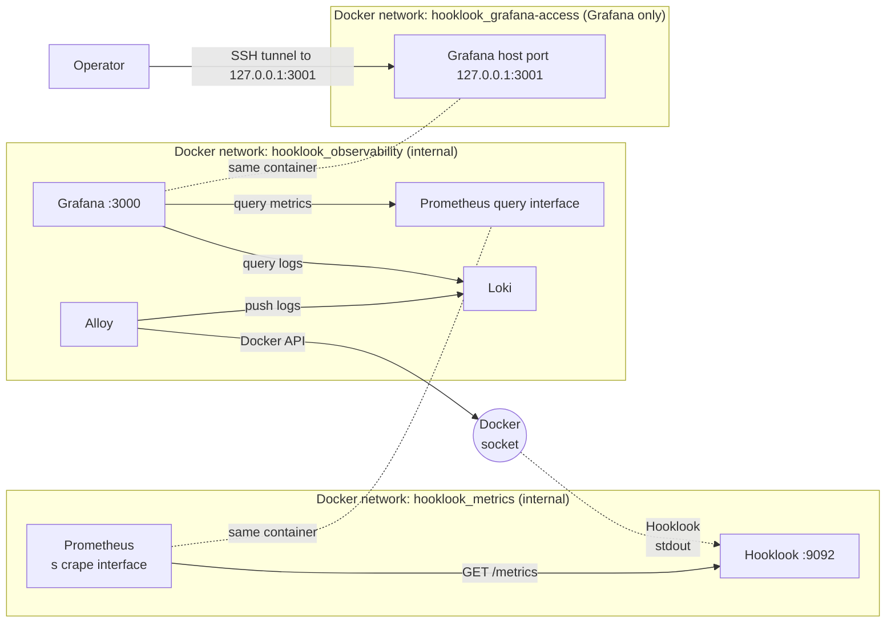

# Observability

Hooklook owns a private Prometheus, Alloy, Loki, and Grafana stack on the same
Docker host as the application. Prometheus collects aggregate metrics from a
separate Hooklook listener; Alloy forwards selected Hooklook container logs to
Loki. Grafana queries both backends for a private operator dashboard. The
[architecture](architecture.md) shows the complete request path, while the
[observability runbook](observability-runbook.md) covers validation, deployment,
access, and rollback.

## Stack topology



The two Prometheus boxes and the two Grafana boxes represent network
attachments of single containers. Hooklook joins both `hooklook_metrics` and
Caddy's `hooklook-edge`; Prometheus joins the metrics and observability
networks. Alloy and Loki join only `hooklook_observability`. Grafana also joins
its dedicated non-internal access bridge because this Docker host did not
publish its loopback port when Grafana had only an internal bridge. No
telemetry endpoint has a public Caddy route.

### Port inventory

| Port | Protocol | Reachability | Purpose |
| --- | --- | --- | --- |
| 9092 | TCP | Hooklook container on `hooklook_metrics` **and** `hooklook-edge`; no host publication or public Caddy route | `/metrics`, scraped by Prometheus |
| 9090 | TCP | Prometheus container on `hooklook_metrics` and `hooklook_observability`; no host publication | Prometheus query API and UI |
| 3100 | TCP | Loki container on `hooklook_observability`; no host publication | Loki ingestion and query API |
| 12345 | TCP | Alloy container loopback (`127.0.0.1`) only; no host publication | Alloy's default debug/readiness HTTP server, unused by the deployment smoke test |
| 3000 | TCP | Grafana container on `hooklook_observability` and `hooklook_grafana-access` | Grafana HTTP server |
| 3001 | TCP | VM loopback (`127.0.0.1`) only, mapped to Grafana container port 3000 | Private operator access through an SSH tunnel |

The app binds both ports 8080 and 9092 to `0.0.0.0` inside its dual-network
container. Caddy can therefore reach 9092 over `hooklook-edge`, and Prometheus
can reach 8080 over `hooklook_metrics`. Docker's `expose` declaration does not
filter either connection. Caddy does not proxy `/metrics` to the public. The
public application ports are inventoried in [architecture](architecture.md#port-inventory).
The Docker socket used by Alloy is a Unix socket, not a TCP port.

## Configuration inventory

| Component | Repository configuration | Durable state | Behavior |
| --- | --- | --- | --- |
| Hooklook metrics | [`observability.go`](../observability.go), [`compose.yaml`](../compose.yaml) | Application SQLite data remains in `hooklook-data` | Serves a private registry on port 9092 |
| Prometheus | [`prometheus.yml`](../observability/prometheus.yml) | `hooklook-prometheus` | Scrapes `hooklook:9092` every 15 seconds; retains 14 days, capped at 2 GB |
| Alloy | [`alloy.alloy`](../observability/alloy.alloy) | `hooklook-alloy` | Reads only the Hooklook application container's Docker stdout and pushes it to Loki |
| Loki | [`loki.yml`](../observability/loki.yml) | `hooklook-loki` | Filesystem TSDB with seven-day log retention |
| Grafana | [`provisioning/`](../observability/grafana/provisioning/) and [`hooklook.json`](../observability/grafana/dashboards/hooklook.json) | `hooklook-grafana` | Provisions Hooklook Prometheus and Loki data sources and one private operator dashboard |
| Stack wiring | [`compose.yaml`](../compose.yaml) | Separate Hooklook-owned named volumes above | Creates the telemetry networks and the loopback-only Grafana publication |

These are Hooklook-specific services, volumes, credentials, and networks. Zibs
uses its own telemetry stack. There is no Hooklook node exporter or VM-level
dashboard; host monitoring is outside this application's observability scope.

## Goals and instrumentation

A request crosses Caddy, one Go process, and local SQLite. Metrics show
availability, traffic, latency, product activity, capacity, and process
pressure. Structured logs provide bounded request and operational context.
Tracing is not part of this stack.

Hooklook registers a private Prometheus registry rather than the global
registry. It includes the Go runtime and process collectors plus these
application metrics:

| Metric family | Type and labels | Meaning |
| --- | --- | --- |
| `hooklook_http_requests_total` | Counter: `route`, `method`, `status` | Completed application HTTP requests, using normalized route classes |
| `hooklook_http_request_duration_seconds` | Histogram: `route`, `method` | Request duration excluding long-lived SSE streams |
| `hooklook_http_in_flight_requests` | Gauge | Current non-SSE handler work |
| `hooklook_capture_results_total` | Counter: `result` | Accepted, missing-bin, capacity-rejected, or internal-error captures |
| `hooklook_bin_operations_total` | Counter: `operation` | Successful create, capture, list, detail, delete, clear, and admin-list operations |
| `hooklook_db_operations_total`, `hooklook_db_operation_duration_seconds`, `hooklook_db_errors_total` | Counter, histogram, counter; bounded operation/result/kind labels | SQLite outcomes, latency, and classified errors |
| `hooklook_expiry_cleanup_runs_total`, `hooklook_expiry_cleanup_duration_seconds`, `hooklook_expired_bins_deleted_total` | Counters and histogram | Cleanup outcomes, duration, and expired-bin deletions |
| `hooklook_sse_connections`, `hooklook_sse_events_total` | Gauge and counter | Open streams and bounded SSE event outcomes |
| `hooklook_storage_bytes`, `hooklook_storage_occupancy_ratio` | Gauges | SQLite allocation, reusable pages, budget, WAL, and filesystem capacity |
| `hooklook_storage_collection_available`, `hooklook_active_bins_collection_available` | Gauges | Whether the most recent bounded collection succeeded; 0 means the related count is stale |
| `hooklook_active_bins`, `hooklook_active_bins_near_limit` | Gauges | Active bins and bins near their count or body-byte allowance |
| `hooklook_db_pool_connections`, `hooklook_db_pool_wait_seconds_total` | Gauge and counter | SQLite pool open/in-use/idle connections and accumulated wait time |

Metric labels never contain bin codes, raw paths or queries, request IDs,
payloads, headers, cookies, invitation IDs, tokens, client IPs, or error text.
`507` means expected capacity rejection and is displayed separately from
application 5xx failures. Caddy-generated `413`, `429`, and `431` do not become
Go HTTP metrics. A proxy-aborted body read may appear as an application-side
`400` while Caddy returns `413` to the client.

Prometheus itself creates `up{job="hooklook"}` for the
[`job_name: hooklook` scrape](../observability/prometheus.yml), targeting
`hooklook:9092`. A value of 1 means the last scrape succeeded; 0 means it
failed. It is not emitted by Hooklook and does not establish SQLite readiness.
Use `/ready` for the bounded SQLite check; `/health` is liveness.

## Logs and access boundary

The app writes JSON to Docker stdout. HTTP entries use bounded route, method,
and status fields plus duration; operation entries record safe event names and
bounded classifications. Captured bodies, raw paths and queries, secret
headers, cookies, invitation IDs, and bearer tokens stay out of logs. Docker
rotates the app's stdout files at 10 MB with three files.

Alloy discovers containers by both `com.docker.compose.project=hooklook` and
`com.docker.compose.service=hooklook`. It forwards only that application's
stdout and uses fixed Loki labels such as `service`, `level`, and `route`.
Filtering limits what is stored in Loki; it does not limit Alloy's authority
over the Docker daemon. Its read-only socket bind still permits Docker API
operations. Treat Alloy and its configuration as privileged host components;
see [deployment security](security.md).

The metrics listener has no host port and is not registered on the public
application mux. Grafana is published only at `127.0.0.1:3001`, disables
anonymous access and signup, and uses separate Hooklook credentials. An
operator can open it through an SSH tunnel:

```sh
ssh -L 3001:127.0.0.1:3001 "$DEPLOY_USER@$DEPLOY_HOST"
```

Then open `http://127.0.0.1:3001` and the **Hooklook → Hooklook operator**
dashboard. There is no public Grafana workspace or shared dashboard route.

## Dashboard and operating checks

The provisioned dashboard has Overview, Traffic and latency, Bin activity,
Capacity and storage, SQLite, Expiry cleanup, Runtime, and Application logs
sections. Its stat panels show current availability and small operational
summaries; time series preserve trends and the Loki panel shows recent safe
application logs. Dashboard JSON in the repository is the durable layout
source. A push to `main` that changes only that JSON deploys just the file and
verifies Grafana provisioning.

After a full or observability deployment, the
[`telemetry-smoke-test.sh`](../scripts/telemetry-smoke-test.sh) checks Grafana's
loopback binding and HTTP API, Hooklook readiness, Prometheus `up=1`, a
Hooklook log in Loki, both Grafana data sources, and dashboard provisioning.
It verifies the telemetry path, not every panel or a visual layout. Follow the
[observability runbook](observability-runbook.md) for configuration validation,
private access, and rollback. Review capacity against `MAX_STORE`, repeated
cleanup failures, sustained 5xx, SQLite waits, and SSE connection behavior
during normal operation.

No alerts are configured yet. Notification destination, thresholds, and
delivery testing remain separate operator work. The dashboard and smoke test
are the current diagnostic tools.
