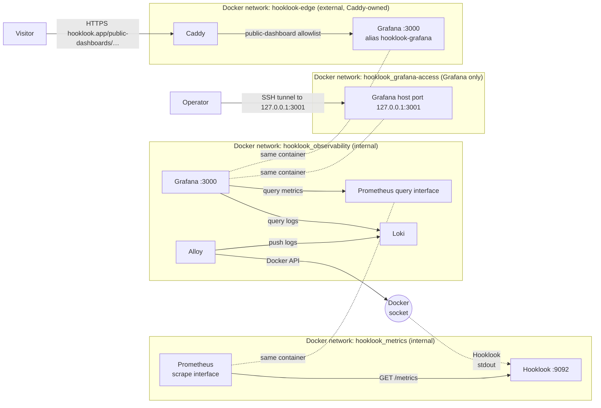

# Observability

Hooklook owns a private Prometheus, Alloy, Loki, and Grafana stack on the same
Docker host as the application. Prometheus collects aggregate metrics from a
separate Hooklook listener; Alloy forwards selected Hooklook container logs to
Loki. Grafana queries both backends for private operator and traffic-class dashboards,
and serves one metrics-only [public dashboard](#public-dashboard). The
[architecture](architecture.md) shows the complete request path, while the
[observability runbook](observability-runbook.md) covers validation, deployment,
access, and rollback. The [dashboard guide](observability-guide.md) teaches
reading the dashboard through scenarios.

## Stack topology

```mermaid
flowchart LR
    operator[Operator] -->|SSH tunnel to 127.0.0.1:3001| grafana_access
    visitor[Visitor] -->|HTTPS hooklook.app/public-dashboards/…| caddy

    subgraph metrics["Docker network: hooklook_metrics (internal)"]
        app_metrics["Hooklook :9092"]
        prom_scrape["Prometheus<br/>scrape interface"]
        prom_scrape -->|GET /metrics| app_metrics
    end

    subgraph private["Docker network: hooklook_observability (internal)"]
        prom_query["Prometheus query interface"]
        alloy[Alloy]
        loki[Loki]
        grafana["Grafana :3000"]
        alloy -->|push logs| loki
        grafana -->|query metrics| prom_query
        grafana -->|query logs| loki
    end

    subgraph access["Docker network: hooklook_grafana-access (Grafana only)"]
        grafana_access["Grafana host port 127.0.0.1:3001"]
    end

    subgraph edge["Docker network: hooklook-edge (external, Caddy-owned)"]
        caddy[Caddy]
        grafana_public["Grafana :3000<br/>alias hooklook-grafana"]
        caddy -->|public-dashboard allowlist| grafana_public
    end

    prom_scrape -.-|same container| prom_query
    grafana -.-|same container| grafana_access
    grafana -.-|same container| grafana_public
    alloy -->|Docker API| socket((Docker<br/>socket))
    socket -.->|Hooklook<br/>stdout| app_metrics
```

The two Prometheus boxes and the three Grafana boxes represent network
attachments of single containers. Hooklook joins both `hooklook_metrics` and
Caddy's `hooklook-edge`; Prometheus joins the metrics and observability
networks. Alloy and Loki join only `hooklook_observability`. Grafana also joins
its dedicated non-internal access bridge because this Docker host did not
publish its loopback port when Grafana had only an internal bridge, and
`hooklook-edge` so Caddy can proxy the [public dashboard](#public-dashboard).
That narrow Grafana path allowlist is the only telemetry with a public Caddy
route.

### Port inventory

| Port | Protocol | Reachability | Purpose |
| --- | --- | --- | --- |
| 9092 | TCP | Hooklook container on `hooklook_metrics` **and** `hooklook-edge`; no host publication or public Caddy route | `/metrics`, scraped by Prometheus |
| 9090 | TCP | Prometheus container on `hooklook_metrics` and `hooklook_observability`; no host publication | Prometheus query API and UI |
| 3100 | TCP | Loki container on `hooklook_observability`; no host publication | Loki ingestion and query API |
| 12345 | TCP | Alloy container loopback (`127.0.0.1`) only; no host publication | Alloy's default debug/readiness HTTP server, unused by the deployment smoke test |
| 3000 | TCP | Grafana container on `hooklook_observability`, `hooklook_grafana-access`, and `hooklook-edge` (alias `hooklook-grafana`) | Grafana HTTP server; Caddy proxies only the public-dashboard allowlist |
| 3001 | TCP | VM loopback (`127.0.0.1`) only, mapped to Grafana container port 3000 | Private operator access through an SSH tunnel |

The app binds both ports 8080 and 9092 to `0.0.0.0` inside its dual-network
container. Caddy can therefore reach 9092 over `hooklook-edge`, and Prometheus
can reach 8080 over `hooklook_metrics`. Docker's `expose` declaration does not
filter either connection. Caddy does not proxy `/metrics` to the public. The
public application ports are inventoried in [architecture](architecture.md#port-inventory).
The Docker socket used by Alloy is a Unix socket, not a TCP port.

## Configuration inventory

| Component | Repository configuration | Durable state | Behavior |
| --- | --- | --- | --- |
| Hooklook metrics | [`observability.go`](../cmd/hooklook/observability.go), [`compose.yaml`](../compose.yaml) | Application SQLite data remains in `hooklook-data` | Serves a private registry on port 9092 |
| Prometheus | [`prometheus.yml`](../observability/prometheus.yml) | `hooklook-prometheus` | Scrapes `hooklook:9092` every 15 seconds; retains 14 days, capped at 2 GB |
| Alloy | [`alloy.alloy`](../observability/alloy.alloy) | `hooklook-alloy` | Reads only the Hooklook application container's Docker stdout and pushes it to Loki |
| Loki | [`loki.yml`](../observability/loki.yml) | `hooklook-loki` | Filesystem TSDB with seven-day log retention |
| Grafana | [`provisioning/`](../observability/grafana/provisioning/) and [`dashboards/`](../observability/grafana/dashboards/) | `hooklook-grafana` | Provisions Hooklook Prometheus and Loki data sources, the private operator dashboard, the synthetic and non-synthetic traffic dashboards, and the shareable public-metrics dashboard |
| Stack wiring | [`compose.yaml`](../compose.yaml) | Separate Hooklook-owned named volumes above | Creates the telemetry networks and the loopback-only Grafana publication, and attaches Grafana to `hooklook-edge` for the public dashboard |

These are Hooklook-specific services, volumes, credentials, and networks. Zibs
uses its own telemetry stack. There is no Hooklook node exporter or VM-level
dashboard; host monitoring is outside this application's observability scope.

## Goals and instrumentation

A request crosses Caddy, one Go process, and local SQLite. Metrics show
availability, traffic, latency, product activity, capacity, and process
pressure. Structured logs provide bounded request and operational context.
Tracing is not part of this stack.

Hooklook registers a private Prometheus registry rather than the global
registry. It includes the Go runtime and process collectors plus these
application metrics:

| Metric family | Type and labels | Meaning |
| --- | --- | --- |
| `hooklook_http_requests_total` | Counter: `route`, `method`, `status`, `traffic_class` | Completed application HTTP requests, using normalized route classes |
| `hooklook_http_request_duration_seconds` | Histogram: `route`, `method`, `traffic_class` | Request duration excluding long-lived SSE streams |
| `hooklook_http_in_flight_requests` | Gauge | Current non-SSE handler work |
| `hooklook_bin_creation_results_total` | Counter: `result`, `traffic_class` | Bin creation attempts from `/`: `created`, `no_cookie` (the client did not return the cookie check), or `store_full` |
| `hooklook_capture_results_total` | Counter: `result`, `traffic_class` | Capture outcomes: `accepted`, `missing_bin`, `bin_full`, `store_full`, or `internal_error` |
| `hooklook_bin_operations_total` | Counter: `operation`, `traffic_class` | Successful create, capture, list, detail, delete, clear, and admin-list operations; list and detail count successful API reads, not page views or SSE reconnects |
| `hooklook_db_operations_total`, `hooklook_db_operation_duration_seconds`, `hooklook_db_errors_total` | Counter, histogram, counter; bounded operation/result/kind labels | SQLite outcomes (`success`, `not_found`, `capacity`, `error`), latency, and real failures only (kind `full` or `other`) |
| `hooklook_expiry_cleanup_runs_total`, `hooklook_expiry_cleanup_duration_seconds`, `hooklook_expired_bins_deleted_total` | Counters and histogram | Cleanup outcomes, duration, and expired-bin deletions |
| `hooklook_sse_connections`, `hooklook_sse_events_total` | Gauge and counter | Open streams and bounded SSE event outcomes |
| `hooklook_storage_bytes`, `hooklook_storage_occupancy_ratio` | Gauges | SQLite allocation, reusable pages, budget, WAL, and filesystem capacity (see below) |
| `hooklook_storage_collection_available`, `hooklook_active_bins_collection_available` | Gauges | Whether the most recent bounded collection succeeded; 0 means the related count is stale |
| `hooklook_active_bins`, `hooklook_active_bins_near_limit` | Gauges | Active bins and bins near their count or body-byte allowance |
| `hooklook_db_pool_connections`, `hooklook_db_pool_wait_seconds_total` | Gauge and counter | SQLite pool open/in-use/idle connections and accumulated wait time |

`hooklook_storage_bytes{kind="allocated"}` measures the main SQLite file
against `kind="budget"` (`MAX_STORE`, rounded down to whole pages).
`kind="reusable"` counts free pages SQLite can reuse, so deleting rows can
raise reusable bytes without shrinking allocated bytes. `main_file`, `wal`, and
`filesystem_available` show pressure outside the page budget. The occupancy
ratio is `allocated ÷ budget`.

Metric labels never contain bin codes, raw paths or queries, request IDs,
payloads, headers, cookies, invitation IDs, tokens, client IPs, or error text.
`507` means expected capacity rejection and is displayed separately from
application 5xx failures. Caddy-generated `413`, `429`, and `431` do not become
Go HTTP metrics. A proxy-aborted body read may appear as an application-side
`400` while Caddy returns `413` to the client.

Prometheus itself creates `up{job="hooklook"}` for the
[`job_name: hooklook` scrape](../observability/prometheus.yml), targeting
`hooklook:9092`. A value of 1 means the last scrape succeeded; 0 means it
failed. It is not emitted by Hooklook and does not establish SQLite readiness.
Use `/ready`, which checks SQLite within 500 ms, for readiness; `/health` is
static liveness.

### Traffic classes

`traffic_class` separates the private synthetic-traffic generator from
everything else:

| Value | Rule | Meaning |
| --- | --- | --- |
| `synthetic` | User-Agent starts with `hooklook-synthetic/` | Request sent by the traffic generator. The marker is attribution, not authentication: anyone can send it. |
| `other` | Every other request | People, crawlers, scanners, health checks, and your own admin calls. Not a verified-human count. |

The generator sends its User-Agent on every request: the two-hop bin
creation, metadata reads, captures, and clears. Only the request and
bin-operation families above carry the class; they are counted by the request
that caused them. SQLite, storage, active-bin, SSE, cleanup, in-flight, and
process metrics stay global, because they cannot be attributed reliably to one
class. Series recorded before the label was deployed have no class, so the
traffic-class dashboards start empty and cannot partition older data.

## Logs and access boundary

The app writes JSON to Docker stdout. HTTP entries use bounded route, method,
status, and `traffic_class` fields plus duration; operation entries record safe event names and
bounded classifications. Captured bodies, raw paths and queries, secret
headers, cookies, invitation IDs, and bearer tokens stay out of logs. Docker
rotates the app's stdout files at 10 MB with three files.

Alloy discovers containers by both `com.docker.compose.project=hooklook` and
`com.docker.compose.service=hooklook`. It forwards only that application's
stdout and uses fixed Loki labels such as `service`, `level`, and `route`.
Filtering limits what is stored in Loki; it does not limit Alloy's authority
over the Docker daemon. Its read-only socket bind still permits Docker API
operations. Treat Alloy and its configuration as privileged host components;
see [deployment security](security.md).

The metrics listener has no host port and is not registered on the public
application mux. Grafana is published only at `127.0.0.1:3001`, disables
anonymous access and signup, and uses separate Hooklook credentials. An
operator reaches it through an SSH tunnel; see
[private access](observability-runbook.md#deployment-preparation-and-private-access).
There is no public Grafana workspace. The only public telemetry is the
externally shared [public dashboard](#public-dashboard), which Caddy proxies
on a narrow path allowlist.

## Public dashboard

**Hooklook public metrics** (UID `hooklook-public-metrics`,
[`public-metrics.json`](../observability/grafana/dashboards/public-metrics.json))
is a deliberately metrics-only view for anyone curious how the service runs.
It is linked from the top of the repository README, not from the app. It has
no variables or annotations, hides the time picker, and always shows the last
24 hours; its bin-creation and capture stats use fixed 24-hour and 7-day
windows. It shows:

- active bins, bins created, accepted captures, and missing-bin captures;
- total requests and the Prometheus `up` signal, shown as yes/no;
- response counts by status, and request latency (average and p95);
- request counts by route class and status, excluding admin routes, static
  assets, and SSE streams;
- capture outcomes, and bin operations excluding the admin listing;
- requests by traffic class, so visitors can tell the synthetic generator's
  volume from everything else. Every other panel includes synthetic traffic;
- SQLite operation duration (average and p95), excluding the admin listing;
- open live-update (SSE) streams.

It must not include:

- Loki logs, or links to Loki or Explore;
- bin codes, raw paths or queries, payloads, headers, invitation IDs, tokens,
  or client information;
- admin routes or the admin listing operation;
- storage bytes, budget occupancy, or bins near their limit. These show how
  close the store is to `store_full`, which would help someone plan to fill it;
- process, runtime, SQLite pool, error-kind, or cleanup internals;
- direct data-source access, Explore, or the wider Grafana workspace.

Caddy serves the shared dashboard on the `hooklook.app` host at
`/public-dashboards/<share-token>`. It forwards only that page, Grafana's
anonymous shared-dashboard API (`/api/public/dashboards/*`), and the public
assets it needs (`/public/build/*`, `/public/img/*`, `/favicon.ico`) to
`hooklook-grafana:3000`, and never the normal workspace or general API. None of
those paths is a Hooklook route. That route lives in
[hetzner-one](https://github.com/dvinubius/hetzner-one)'s `Caddyfile`.
Grafana joins `hooklook-edge` under the alias `hooklook-grafana` because Caddy
also joins `zibs-edge`, where zibs's Grafana answers to the Compose service
name `grafana`. Compose adds the service name as an alias on every network, so
a bare `grafana` upstream would be ambiguous for Caddy; both Caddy routes must
use a name that exists on only one network.

Grafana's externally shared dashboards run only the dashboard's saved queries,
unlike anonymous Viewer access, which could explore data freely. Sharing is
Grafana runtime state in the `hooklook-grafana` volume, not provisioning, so it
survives redeployments. Share, pause, and revoke it as described in the
[observability runbook](observability-runbook.md#share-only-the-public-dashboard).

## Dashboard and operating checks

The provisioned **Hooklook → Hooklook operator** dashboard shows all traffic
and is described panel by panel, with scenarios for using it, in the
[dashboard guide](observability-guide.md). **Hooklook synthetic traffic** and
**Hooklook non-synthetic traffic** repeat only its request, capture, and
bin-operation panels, filtered by [traffic class](#traffic-classes), plus the
matching request logs. **Hooklook public metrics** is the one dashboard that
may be shared outside the operator workspace; see
[public dashboard](#public-dashboard). Dashboard JSON in the repository is the
durable layout source. A push to `main` that changes only dashboard JSON
deploys just those files and verifies Grafana provisioning of all four.

After a full or observability deployment, the
[`telemetry-smoke-test.sh`](../scripts/telemetry-smoke-test.sh) checks Grafana's
loopback binding and HTTP API, Hooklook readiness, Prometheus `up=1`, a
Hooklook log in Loki, both Grafana data sources, and dashboard provisioning.
It verifies the telemetry path, not every panel or a visual layout. Follow the
[observability runbook](observability-runbook.md) for configuration validation,
private access, and rollback.

No alerts are configured yet. Notification destination, thresholds, and
delivery testing remain separate operator work. The dashboard and smoke test
are the current diagnostic tools.
